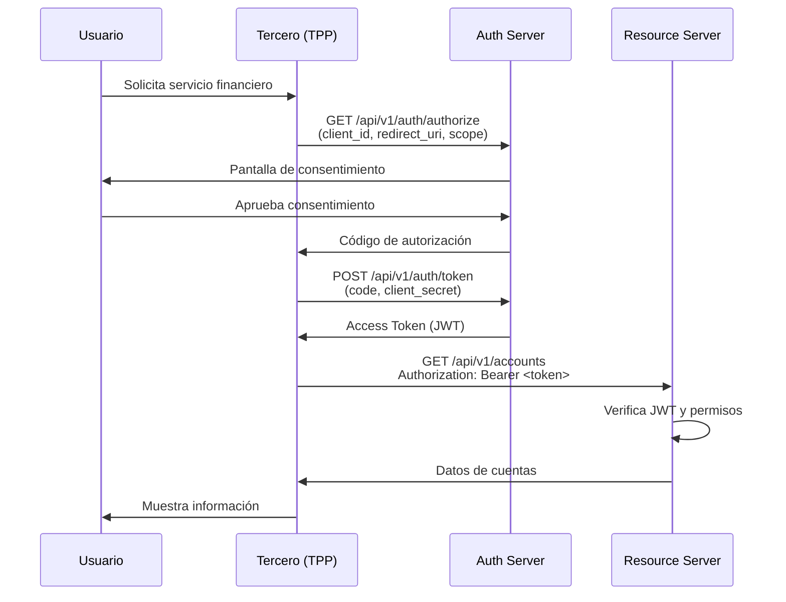

# Arquitectura del Sistema — Open Banking Argentina

## Visión General

El sistema Open Banking AR está compuesto por un frontend Next.js, un backend Express/TypeScript y servicios de infraestructura (PostgreSQL, Redis), todos orquestados con Docker Compose.

## Diagrama de Componentes

```
┌─────────────────────────────────────────────────────┐
│                    Usuario Final                     │
└─────────────────────┬───────────────────────────────┘
                      │ HTTP (puerto 3000)
┌─────────────────────▼───────────────────────────────┐
│              Frontend (Next.js 14)                  │
│  - App Router (RSC + Client Components)             │
│  - Tailwind CSS                                     │
│  - Proxy /api/v1/* → backend:3001                   │
└─────────────────────┬───────────────────────────────┘
                      │ HTTP (puerto 3001)
┌─────────────────────▼───────────────────────────────┐
│              Backend (Express + TypeScript)          │
│  ┌──────────┐  ┌──────────┐  ┌──────────────────┐  │
│  │ /accounts│  │ /payments│  │ /consent  /auth  │  │
│  └──────────┘  └──────────┘  └──────────────────┘  │
│  ┌──────────────────────────────────────────────┐   │
│  │       Middlewares: JWT, CORS, Helmet         │   │
│  └──────────────────────────────────────────────┘   │
└──────────┬──────────────────────────┬───────────────┘
           │                          │
┌──────────▼──────┐        ┌──────────▼──────┐
│  PostgreSQL 16  │        │    Redis 7       │
│  (puerto 5432)  │        │  (puerto 6379)   │
└─────────────────┘        └─────────────────┘
```

## Módulos del Backend

### `/api/v1/accounts`
Gestión de cuentas bancarias. Expone:
- `GET /` — lista de cuentas del usuario autenticado
- `GET /:id` — detalle de una cuenta (saldo, CBU, alias)
- `GET /:id/transactions` — movimientos de la cuenta

### `/api/v1/payments`
Iniciación de pagos via Transferencias 3.0:
- `POST /initiate` — inicia un pago (requiere consentimiento previo)
- `GET /:id/status` — estado del pago

### `/api/v1/consent`
Gestión de consentimientos OAuth:
- `POST /` — crea un nuevo consentimiento con permisos
- `GET /:id` — obtiene el estado de un consentimiento
- `DELETE /:id` — revoca un consentimiento

### `/api/v1/auth`
Autenticación OAuth 2.0:
- `POST /token` — emite un access token JWT
- `POST /authorize` — genera código de autorización
- `POST /revoke` — revoca un token

## Flujo OAuth 2.0 — Open Banking



## Seguridad

- **JWT (JSON Web Tokens):** todos los endpoints protegidos requieren `Authorization: Bearer <token>`
- **Helmet.js:** cabeceras HTTP de seguridad (CSP, HSTS, etc.)
- **CORS:** configurado para permitir únicamente orígenes autorizados
- **Consentimientos:** cada acceso requiere un consentimiento explícito del usuario
- **Variables de entorno:** secrets nunca hardcodeados en el código

## Infraestructura

```yaml
Servicios Docker:
  - backend:   Node.js 20 Alpine  →  :3001
  - frontend:  Node.js 20 Alpine  →  :3000
  - postgres:  PostgreSQL 16 Alpine → :5432
  - redis:     Redis 7 Alpine     →  :6379
```

## CI/CD (GitHub Actions)

El pipeline se activa en cada push y PR a `main`:
1. **Job backend:** instala dependencias → `tsc --noEmit` (type check)
2. **Job frontend:** instala dependencias → `next build`
